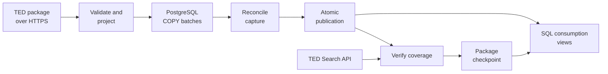

# Tender Ledger

[](https://github.com/alpastorvillar-design/tender-ledger/actions/workflows/ci.yml)

A recoverable pipeline for public procurement notices and PostgreSQL analytics.

**Status:** the archive inspector, a transactional package loader into
PostgreSQL, coverage verification of a loaded capture against the TED Search API,
and an ingest command that acquires one package and checkpoints it only when both
hold are implemented, for daily and monthly package identities. The projection
contract (v3) preserves official eForms change references as an ordered
one-to-many relation and selects publication dates by their structural paths
across observed legacy and eForms namespace variants. A checkpoint sealed under
an older contract is never replayed, and six analytical SQL workloads answer grain, coverage-calendar,
cutoff-state and cross-package-overlap questions with correctness fixtures.
A versioned manifest format and a sequential runner compose `ingest` over an
explicit, ordered list of packages, stopping at the first one that is not
processed, with no manifest-level table or transaction of its own. Lint and
the full test suite pass locally against real PostgreSQL, without skipped
tests; the badge above reports the latest CI run on `main`. A twenty-seven
package real data run reached **1,393,588 distinct notices whose coverage the
source confirmed exactly**, with a real mid-load interruption and resume,
a complete 26-package replay without HTTP, SQL benchmarks and a partitioning
experiment at that scale.
One package is blocked by a gap in TED's own monthly archive, described in
[million-notice-run.md](docs/million-notice-run.md). The accepted data scope is
the 26 exactly reconciled packages; full 2020-2025 coverage remains a documented
extension. Workflow orchestration is still pending.

## Problem

Procurement analysts need a queryable record of public notices, changes, and data coverage. Failed downloads and repeated batches must not silently produce missing records or double counting.

The historical target is TED notices across countries for 2020–2025, with Spain as one analytical case. Completion requires at least one million distinct real notices, reconciled coverage, measured SQL performance, and recovery evidence.

## What it delivers

Load a TED archive into a queryable database, repeat the load safely, and recover
from an interruption without rewriting committed batches. Analysts can count
distinct notices by publication month, buyer country, and procurement category
without double counting overlapping source packages.

| Implemented | Evidence |
| --- | --- |
| Legacy XML and eForms inspection and projection | Twenty-seven real daily/monthly packages: 1,450,598 published observations and 1,447,631 distinct notices |
| Durable batch loading and atomic publication | Recovery, reader visibility, concurrency, and corruption tests |
| SQL over published, deduplicated notices | Six workloads measured on 1,450,598 observations, with identical checksums across index variants |
| Coverage verification against the Search API | Twenty-six packages matched identifier for identifier across 5,843 API pages |
| Explicit coverage state | Verified, mismatch, unavailable and unconfirmed-empty are four different answers, each with its recorded evidence |
| Bounded, recoverable package download | Truncation, oversized bodies, redirects off-origin, corrupt archives and 404s are all refused; interruptions restart from byte zero |
| A checkpoint that only a complete flow can seal | Validated artifact plus published capture plus a named verified attempt, re-checked in one transaction and read back |
| One resource policy per package kind | Archive, download and Search API limits are derived from the package identity, with their coherence asserted at construction |
| A compatibility survey before a load | The same walker and the same projection inventory formats, schema versions, roots and rejection reasons instead of stopping at the first one |
| Two real monthly archive layouts | Flat XML, or exactly one level of nested daily `.tar.gz`, streamed under the same ceilings; a daily package refuses nesting and a container inside a container is refused everywhere |
| Official change references as a relation, not a column | Every `efbc:ChangedNoticeIdentifier`, kept ordered and atomic with its notice; a real archive showed this is genuinely one-to-many |
| A replay that checks its own contract version | A checkpoint sealed under an older projection contract is never replayed as processed, only reprojected under the current one |
| Six analytical SQL workloads with correctness fixtures | Latest-capture ranking, change-reference resolution, acquisition cutoffs, a coverage calendar, and cross-package overlap auditing |
| A versioned manifest and sequential backfill runner | Strict schema validation before I/O; a 26-package verified manifest completes and replays without HTTP or new database state, while the 27-package audit manifest retains the known source gap |
| A source disagreement the pipeline refuses to absorb | TED's API reports one May 2021 notice its own monthly archive omits; the capture stays unverified, no checkpoint is sealed, and the manifest stops there |

## Architecture



Python implements archive handling, ingestion and verification. PostgreSQL stores
notice data and transactional state; Docker Compose provides the local database.
A restricted reader role sees published notice rows while incomplete replacements
remain internal. The filesystem and the database share no transaction, so the
ingest run records each durable step and recovers from it; Airflow will later
coordinate the verified workflow.

See [source and design decisions](docs/design.md),
[transaction boundaries and recovery](docs/loading.md),
[coverage verification](docs/verification.md),
[download, recovery and checkpoint](docs/ingestion.md),
[field projection](docs/projection.md), and
[the manifest format and sequential backfill runner](docs/backfill.md).

## Quick start

Requires Python 3.13+ and Docker with Linux containers; the validated Python
version is 3.14.3. From a terminal:

```sh
git clone https://github.com/alpastorvillar-design/tender-ledger.git
cd tender-ledger
python -m venv .venv
```

Activate the environment with `.venv\Scripts\Activate.ps1` in PowerShell or
`source .venv/bin/activate` in Bash, then run:

```sh
python -m pip install -e ".[dev]" -c constraints.txt
python scripts/create_local_env.py
docker compose up -d --wait postgres
python -m tender_ledger db upgrade
python scripts/run_tests.py
```

This runs synthetic correctness fixtures against PostgreSQL; it does not download
the historical dataset. To inspect and load real data, download a package from
[TED](https://ted.europa.eu/packages/daily/202300220) into the ignored `data/`
directory and follow the commands below. That mixed daily package was about
12 MiB compressed when checked. Keep its source package ID with the file.
See [local development](docs/local-development.md) for configuration and persistence.

## Run the inspector

Requires Python 3.13 or newer; tested with Python 3.14.3. The inspector uses only the standard library and needs no installation or network access. The database loader adds one dependency (`psycopg`). The commands below run only the standard-library tests; full-suite setup follows later.

From the repository root in PowerShell:

```powershell
$env:PYTHONPATH = "$PWD/src"
python -m tender_ledger inspect path/to/daily-package.tar.gz
python -m unittest discover -s tests -p test_packages.py -v
python -m unittest discover -s tests -p test_projection.py -v
```

On Linux/macOS:

```sh
PYTHONPATH=src python -m tender_ledger inspect path/to/daily-package.tar.gz
PYTHONPATH=src python -m unittest discover -s tests -p test_packages.py -v
PYTHONPATH=src python -m unittest discover -s tests -p test_projection.py -v
```

The inspector prints a JSON summary with checksums, distinct notice counts, formats, and schema versions. Invalid archives exit with a nonzero status. It checks gzip integrity, duplicate identities, supported roots, required identity fields, and configured resource limits without extracting XML files to disk.

Pass `--package-id daily/202300220` or `--package-id monthly/2020-01` to check the archive against that package kind's own policy; without one, the flags default to the daily ceilings of 64 MiB compressed, 512 MiB expanded, 8 MiB per member, and 10,000 notices. With an identity the policy is the maximum: a `--max-*` flag may narrow it and is refused if it would widen it. See `inspect --help`. The identity set uses memory proportional to the number of distinct notices in the archive. This bounded inspector is not the historical database loader or a full XML-schema validator.

A successful inspection does not establish source completeness: the output always marks `source_coverage_verified` false. That is what `verify` is for, and an empty archive stays unconfirmed even then.

Add `--survey` to inventory an archive instead of stopping at the first member that cannot be loaded:

```sh
python -m tender_ledger inspect path/to/package.tar.gz --package-id monthly/2020-01 --survey
```

Because a load is all-or-nothing, one unsupported member condemns a whole capture. The survey walks the same archive through the same defenses and reports the formats, schema versions and roots it holds, the members a load would reject with a reason code for each, and repeated identities — then says whether the archive is loadable at all. It writes nothing to the database and reports no XML content. See [surveying an archive](docs/loading.md#surveying-an-archive-before-loading-it).

## Load a package into PostgreSQL

After the quick start, load a local archive using its TED package identity:

```sh
python -m tender_ledger load path/to/package.tar.gz --package-id daily/202300220
python -m tender_ledger status --package-id daily/202300220
```

The identity selects the resource policy the archive is checked against, so a
monthly package is not squeezed into daily ceilings and a daily one does not
inherit monthly ones. The command refuses labels outside the canonical daily and
monthly identity forms before it opens PostgreSQL.

The loader persists a capture identity before loading, streams and projects
members (see [projection contract](docs/projection.md)), writes deterministic
`COPY` batches whose rows and status commit together, reconciles counts, and
publishes the capture with a single transactional pointer swap. Retries resume,
re-acquisitions are new captures, and readers keep the previous complete capture
until a replacement publishes. Full semantics and guarantees:
[transactional loading](docs/loading.md). Example analytical and diagnostic SQL
is under [`queries/`](queries/).

## Verify what the source says it published

A complete local load is not evidence that the archive held the whole issue:

```sh
python -m tender_ledger verify --capture-id 1
```

The capture's identity produces the query - `daily/202300220` is OJ S issue 220
of 2023, not the 220th day - and the command compares every canonical identifier
the API reports with the ones in that capture. It exits 0 only when a `verified`
row is committed. `mismatch`, `unavailable` and `empty_unconfirmed` are three
different failures, each recorded with its counts, its bounded difference
samples, and a key digest when a complete key set was seen. `coverage_verified`
tracks the latest attempt, so a later failure lowers it and keeps the earlier
evidence in the history.

Ending the walk is the hard part: the source's last page of data was short, and
the page after it was empty while still returning a pagination token, so neither
signal ends it. Records, distinct identifiers and the announced total must agree.
See [coverage verification](docs/verification.md) for the states, budgets, retry
rules and locking, and [`queries/`](queries/README.md) for reporting them.

## Process one package end to end

`load` says the archive loaded; `verify` says the source agrees. Neither makes a
package processed. This does:

```sh
python -m tender_ledger ingest --package-id daily/202300220
```

The URL is derived from the identity — `monthly/2024-01` is fetched from the
observed `packages/monthly/2024-1` and stored as `2024-01.tar.gz` — and cannot be
supplied on the command line.
The archive is streamed to a temporary file under byte and time budgets,
validated as a complete gzip-tar package, fsynced and renamed into `data/`, and
only then referenced in the database. The capture link is written in the same
transaction that creates the capture, so an interruption before the first batch
still knows which capture to resume. Exit code 0 means a checkpoint naming the
artifact checksum, the published capture and the specific verified attempt,
re-checked in one short transaction and read back after it commits.

Whether that checkpoint still describes the package is derived, not stored: a
`load --force-recapture` or a later failed check retires it while keeping the
evidence of what was sealed. Re-running `ingest` with a current checkpoint
re-validates the stored artifact and replays the existing success without a
single request. See [ingestion](docs/ingestion.md) for the recovery table,
budgets and locking.

## Run a manifest of packages

```sh
python -m tender_ledger ingest-manifest --manifest manifests/m3-scale-verified.json
```

`ingest-manifest` calls `ingest` once per package a versioned manifest names,
in order, one PostgreSQL connection at a time, and stops at the first package
that is not processed -- the packages after that point are never attempted. It
adds no manifest-level table or transaction: a second run over the same
manifest replays every package whose checkpoint is still current and resumes
whichever one was interrupted, using exactly the recovery `ingest` already
has. [`manifests/m3-scale-verified.json`](manifests/m3-scale-verified.json)
names the twenty-six packages with exact checkpoints and completes from start
to finish. [`manifests/m3-scale.json`](manifests/m3-scale.json) retains all
twenty-seven identities as the source-audit manifest, including the package
whose source evidence disagrees, and
[`manifests/m3-pilot.json`](manifests/m3-pilot.json) the five of the earlier
rehearsal; listing an identity is not evidence it has been downloaded. A run of
the audit manifest stops at its seventeenth entry, `monthly/2021-05`, whose
coverage the source cannot confirm -- see
[the million-notice run](docs/million-notice-run.md). See
[manifest format and backfill](docs/backfill.md) for the schema, the report
shape and what is deliberately not here yet.

## Query the result

The consumption grain is one canonical publication per row, even when daily and
monthly packages overlap. Count it directly:

```sql
select count(*) as distinct_notices
from tl_read.distinct_notice;
```

[Monthly counts](queries/monthly_notice_counts.sql) groups those notices by
publication month, buyer country, and primary CPV division: **34,330 groups**
over the 1,447,631 distinct notices of the scale run, and 611 groups summing to
2,967 over the single verified daily load. Missing classifications remain
explicit. These counts describe published notices, not awarded contracts or
procurement spending.

[Diagnostics](queries/diagnostics.sql) exposes capture status, missing fields,
schema versions, and source overlap. [Coverage status](queries/coverage_status.sql)
reports every published capture including never-verified ones, and
[verification history](queries/verification_history.sql) lists each capture's
attempts in order. [Ingest status](queries/ingest_status.sql) separates a package
that was never checkpointed from one whose checkpoint a later acquisition or a
later coverage check retired, and [ingest history](queries/ingest_history.sql)
shows how far each run got. [`queries/README.md`](queries/README.md) states each query's
grain and how it treats missing values.

Six analytical workloads answer specific SQL-portfolio questions, each with a
correctness fixture: the [latest complete observation per publication](queries/latest_capture_per_publication.sql),
[official change references and their resolution](queries/official_change_references.sql),
[state at an acquisition cutoff](queries/acquisition_cutoff_state.sql), a
[monthly coverage calendar](queries/monthly_coverage_calendar.sql), and a
[cross-package overlap audit](queries/cross_package_overlap_audit.sql) using
`NOT EXISTS` and `EXCEPT`. They are tested against synthetic fixtures and
measured against 1,450,598 real observations (1,447,631 distinct notices), with
matching row counts and checksums before and after a candidate index; see
[million-notice-run.md](docs/million-notice-run.md) and
[scale-and-sql.md](docs/scale-and-sql.md).

## Verified evidence

- Six annual API counts sum to **4,523,626 reported results** for 2020–2025. These are not loaded database rows.
- HEAD responses for 72 monthly packages total **16,783,140,714 bytes (15.63 GiB)** compressed; 26 monthly artifacts plus one overlapping daily sample are local, and 46 historical monthly packages have not been downloaded.
- A real mixed daily package contained **2,967 distinct notices**: 1,813 legacy and 1,154 eForms. Its complete identifier set matched the API across 12 pages.
- The inspector processed that package successfully; its checks are covered by automated tests.
- That same real package (2,967 notices, 1,813 legacy + 1,154 eForms) was loaded into PostgreSQL as an M1 smoke: members, distinct keys, and loaded rows all reconciled at 2,967, a replay was a no-op, and every view reported `source_coverage_verified = false`.
- The full test suite is **480 tests**, run locally without skips: archive/projection tests, HTTP and pagination tests against local test servers and a scripted transport, and real-database tests for replay, durable batches, caller-transaction rejection, interrupted recapture, cancellation, publish visibility, corruption, A/B/A, retired members, concurrency, recovery equivalence, and coverage-verification outcomes. Regression tests reject late or truncated HTTP responses, stale or internally inconsistent checkpoints, unbalanced nested locks, unknown counts supporting a verification claim, a privacy date shadowing an authoritative eForms publication date, and unqualified legacy sections below a namespaced root. The ingest tests interrupt the flow at each durable boundary -- including a real termination of a test-only PostgreSQL session during the checkpoint transaction -- resume from another connection, and compare the result with a clean run over the same bytes. Package-identity tests cover the derived URL, destination, interval and query for both kinds, the resource-policy invariants, and which policy each of `inspect`, `load`, `verify` and `ingest` selects; membership tests cover both edges of a month, a leap February, dates outside it, and a local capture whose rows do not belong to the month it names; survey tests cover an inventory of formats, roots and rejection reasons against archives that a load refuses outright, and require the survey's verdict to match what a load of the same archive actually does. Nested-container tests cover a compatible nested month, a daily package refusing nesting, a second nesting level, a mixed flat/nested archive, unsafe paths, symlinks, sparse and non-XML members inside a container, corrupt, truncated and over-long containers, each nesting limit, and a duplicate identity spanning two containers; acquisition tests require a failed download to report the requests and bytes it actually cost. Contract tests cover ordered change-reference projection, atomic persistence with an independently checked reference count, cancellation and recovery producing the same reference rows as a clean run, a checkpoint sealed under an older contract never replaying, and the six analytical workloads against synthetic fixtures. Manifest and benchmark tests cover strict validation before I/O, stop-on-first-failure sequencing, connection ownership, recovery, contract-aware replay, bounded reporting, private-path-safe provenance, deterministic result checksums and safe parameter rendering.
- **Live verification** against the TED Search API on 2026-09-03 matched all 2,967 identifiers in 13 requests, with no duplicates or differences. The check passed on a disposable copy before migration 0003 was applied to development. Verification of the development capture then committed `source_coverage_verified = true`, preserving all notice rows, batches, and the publication pointer. The canonical key digest matched earlier independent comparisons of the same issue.
- A **bounded live ingest** of that same package on 2026-09-03 downloaded 12,377,691 bytes in one HTTP attempt (sha256 `f9ef1ffdcc78060fa7025f77f2eaf0b0808c0e0bc8c8dccb0722db3867a1f2a2`), validated and loaded 2,967 notices (1,813 legacy, 1,154 eForms), matched all 2,967 identifiers across 13 API requests with no duplicates or differences, and sealed a checkpoint: 10.4 s end to end. Re-running the command replayed the stored evidence with no request of any kind. It ran against a disposable database and a private temporary directory; the key digest matched the earlier independent comparison of the same issue.
- An additional local recovery probe terminated its own PostgreSQL writer session after a committed batch. The retry kept the capture identity, skipped the committed batch, and published the remaining rows. This is a controlled failure test, not a production incident.
- A **measured rehearsal** processed and verified all five real package identities in the pilot manifest under contract v3: `monthly/2020-01` (50,123), `monthly/2020-02` (50,522), `monthly/2023-11` (61,638), `monthly/2024-01` (65,708), and `daily/202300220` (2,967). Every package matched the TED Search API exactly, with no missing, extra or duplicate identifiers. Published total: **230,958 observations and 227,991 distinct notices**, which meets the 100,000-notice gate and not the million-notice one. A complete second manifest run replayed all five with zero HTTP and no new captures, runs, checkpoints or verification attempts. The daily package is an exact subset of `monthly/2023-11` (2,967 shared, none only in the day). The six workloads ran with 20 timed repetitions and matching checksums before and after candidate indexes, and annual partitioning was measured on an isolated copy. See [measured-rehearsal.md](docs/measured-rehearsal.md).

- The **million-notice run** processed the twenty-seven identities of `manifests/m3-scale.json` — the 24 monthly packages of 2020 and 2021 plus the three already-accepted modern samples. Twenty-six matched the TED Search API exactly across 5,843 API pages, giving **1,393,588 distinct notices with source-confirmed coverage** inside **1,450,598 published observations and 1,447,631 distinct notices**. A real backend termination after ten committed batches was resumed into the same capture with every earlier batch byte-identical, and the resumed content checksums equal to a clean load of the same bytes. The corresponding 26-entry verified manifest then replayed completely without HTTP or new durable state. `monthly/2021-05` is the exception and stays unverified: the API reports `231901-2021` for that month, the monthly archive does not contain it, and the daily package `daily/202100089` does — a gap in the source, reproduced independently. See [million-notice-run.md](docs/million-notice-run.md).

Inspector checks were performed on 2026-09-02; the loader smoke on 2026-09-03; the measured rehearsal on 2026-09-04 and 2026-09-05; the million-notice run on 2026-09-06. No cloud deployment has run.

See [design and source contract](docs/design.md), [projection contract](docs/projection.md), [transactional loading](docs/loading.md), [scale and SQL requirements](docs/scale-and-sql.md), and the [measured rehearsal](docs/measured-rehearsal.md).

## Local database setup

[Local development](docs/local-development.md) describes the prepared PostgreSQL
Compose configuration, private password generation, and data persistence. The
PostgreSQL 17.11 container passed connectivity, transaction rollback, and restart
persistence checks on 2026-09-03, and now runs the loader's schema and integration
tests (against a dedicated `tender_ledger_test` database).

## Continuous integration

[CI](.github/workflows/ci.yml) uses Python 3.14.3 and a disposable PostgreSQL
17.11 service, installs the constrained dependencies, runs Ruff, and executes
the full suite. Skipped tests fail the gate, so an unavailable database cannot
produce a successful integration result. No TED download is part of CI.

To run the same lint and test commands locally after the environment setup:

```sh
python -m ruff check src tests scripts --no-cache
python scripts/run_tests.py
```

The test runner creates and replaces its dedicated test databases; use a local
development server or disposable CI service. It does not target the development
database. The [GitHub Actions history](https://github.com/alpastorvillar-design/tender-ledger/actions/workflows/ci.yml)
records the same Ruff and strict test gates on Ubuntu 24.04, Python 3.14.3, and
PostgreSQL 17.11; the badge above reports the current state of `main`.

## Roadmap and limits

1. Add local Airflow orchestration over the verified flow and define artifact,
   report, log and metadata retention.
2. Keep complete 2020–2025 coverage as an optional extension. The accepted
   portfolio scope is the 26 exactly verified packages: it exceeds one million,
   covers the required formats and layouts, and has measured recovery, SQL and
   resource behavior. The remaining 46 monthly archives would add volume but no
   new completion gate; the source gap also prevents one strict manifest from
   finishing unchanged.

The current real-data validation covers twenty-seven package identities across
2020, 2021, 2023 and 2024, including flat and nested monthly layouts, legacy and
eForms notices, a real mid-load interruption and resume, exact per-package
coverage, cross-package overlap, a zero-request replay and query plans at
1.45 million rows. There is no publication calendar, artifact-retention policy
or parallelism yet. Historical completeness and cloud execution have not been
demonstrated, and one 2021 package remains unverifiable because TED's API and
TED's monthly archive disagree about it.
Source artifacts and database volumes stay outside Git. Synthetic fixtures test
correctness and failures; they do not count toward the real-data scale target.
The implemented projection excludes contact details and monetary amounts.

[Scale and SQL requirements](docs/scale-and-sql.md) defines the remaining gates.
Local execution requires no cloud account or paid API.

## Sources

[TED XML packages](https://docs.ted.europa.eu/ODS/latest/reuse/download-xml.html), [direct download conventions](https://docs.ted.europa.eu/ODS/latest/reuse/download-direct.html), and [Search API](https://docs.ted.europa.eu/api/latest/search.html).
