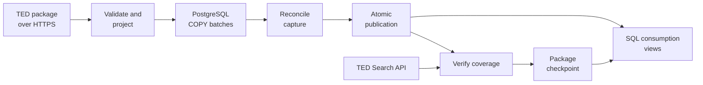

# Tender Ledger

[](https://github.com/alpastorvillar-design/tender-ledger/actions/workflows/ci.yml)
[](LICENSE)

A recoverable pipeline for public procurement notices and PostgreSQL analytics.

**Status:** the local implementation is complete. It downloads daily and monthly
TED archives, projects legacy XML and eForms into PostgreSQL, verifies each
capture against the TED Search API, and seals a checkpoint only after both sides
agree. A versioned manifest runs packages sequentially, and Airflow 3.3.1 adds
manual orchestration, visible task history and bounded retries without becoming
a second pipeline state machine.

The measured run contains **1,450,598 observations** and **1,447,631 distinct
notices**. Twenty-six packages provide **1,393,588 distinct notices with exact
source-confirmed coverage**. One monthly package remains deliberately
uncheckpointed because TED's API contains an identifier that its own monthly
archive omits.

## Problem

Procurement analysts need a queryable record of public notices, changes, and data coverage. Failed downloads and repeated batches must not silently produce missing records or double counting.

The historical target is TED notices across countries for 2020–2025, with Spain as one analytical case. Completion requires at least one million distinct real notices, reconciled coverage, measured SQL performance, and recovery evidence.

## What it delivers

Load a TED archive into a queryable database, repeat the load safely, and recover
from an interruption without rewriting committed batches. Analysts can count
distinct notices by publication month, buyer country, and procurement category
without double counting overlapping source packages.

| Implemented | Evidence |
| --- | --- |
| Transactional, recoverable loading | Deterministic `COPY` batches commit independently; publication is atomic and incomplete replacements stay hidden from readers |
| Source coverage as a hard gate | Twenty-six packages matched identifier for identifier across 5,843 API pages; mismatch, unavailable and empty states cannot seal a checkpoint |
| Defensive archive handling | Bounded streaming, gzip/tar integrity checks, safe paths, explicit schema allowlists and compatibility surveys for flat and nested packages |
| Cross-package data model | Captures preserve source history while `tl_read.distinct_notice` resolves overlapping daily and monthly observations to one publication |
| Versioned projection contract | Legacy XML and eForms are projected consistently; ordered official change references remain relational and older checkpoints cannot replay under newer code |
| Sequential historical runner | Strict manifests stop on the first incomplete package, resume from durable state and replay current checkpoints without HTTP |
| Local Airflow orchestration | A manual three-task Dag validates, runs and attests a manifest; losing the task process produces a recorded failed try and a successful retry |
| Measured SQL decisions | Six workloads keep identical results across candidate-index and partitioning experiments; neither optimization was adopted without a measured benefit |
| Automated verification | 517 PostgreSQL-backed tests with zero skips locally and in GitHub Actions; seven separate Dag contract tests inside the pinned Airflow image; Ruff |
| Transparent source disagreement | The May 2021 archive/API mismatch remains published as evidence and never becomes a false success |

## Architecture



Python implements archive handling, ingestion and verification. PostgreSQL stores
notice data and transactional state; Docker Compose provides the local database.
A restricted reader role sees published notice rows while incomplete replacements
remain internal. The filesystem and the database share no transaction, so the
ingest run records each durable step and recovers from it. A local Airflow
stack triggers, retries and reports that flow while owning none of its state,
keeping its own metadata in a separate database.

See [source and design decisions](docs/design.md),
[transaction boundaries and recovery](docs/loading.md),
[coverage verification](docs/verification.md),
[download, recovery and checkpoint](docs/ingestion.md),
[field projection](docs/projection.md),
[the manifest format and sequential backfill runner](docs/backfill.md), and
[local orchestration](docs/orchestration.md).

## Quick start

Requires Python 3.13+ and Docker with Linux containers; the validated Python
version is 3.14.3. From a terminal:

```sh
git clone https://github.com/alpastorvillar-design/tender-ledger.git
cd tender-ledger
python -m venv .venv
```

Activate the environment with `.venv\Scripts\Activate.ps1` in PowerShell or
`source .venv/bin/activate` in Bash, then run:

```sh
python -m pip install -e ".[dev]" -c constraints.txt
python scripts/create_local_env.py
docker compose up -d --wait postgres
python -m tender_ledger db upgrade
python scripts/run_tests.py
```

This runs synthetic correctness fixtures against PostgreSQL; it does not download
the historical dataset. To inspect and load real data, download a package from
[TED](https://ted.europa.eu/packages/daily/202300220) into the ignored `data/`
directory and follow the commands below. That mixed daily package was about
12 MiB compressed when checked. Keep its source package ID with the file.
See [local development](docs/local-development.md) for configuration and persistence.

## Run the inspector

Requires Python 3.13 or newer; tested with Python 3.14.3. The inspector uses only the standard library and needs no installation or network access. The database loader adds one dependency (`psycopg`). The commands below run only the standard-library tests; full-suite setup follows later.

From the repository root in PowerShell:

```powershell
$env:PYTHONPATH = "$PWD/src"
python -m tender_ledger inspect path/to/daily-package.tar.gz
python -m unittest discover -s tests -p test_packages.py -v
python -m unittest discover -s tests -p test_projection.py -v
```

On Linux/macOS:

```sh
PYTHONPATH=src python -m tender_ledger inspect path/to/daily-package.tar.gz
PYTHONPATH=src python -m unittest discover -s tests -p test_packages.py -v
PYTHONPATH=src python -m unittest discover -s tests -p test_projection.py -v
```

The inspector prints a JSON summary with checksums, distinct notice counts, formats, and schema versions. Invalid archives exit with a nonzero status. It checks gzip integrity, duplicate identities, supported roots, required identity fields, and configured resource limits without extracting XML files to disk.

Pass `--package-id daily/202300220` or `--package-id monthly/2020-01` to check the archive against that package kind's own policy; without one, the flags default to the daily ceilings of 64 MiB compressed, 512 MiB expanded, 8 MiB per member, and 10,000 notices. With an identity the policy is the maximum: a `--max-*` flag may narrow it and is refused if it would widen it. See `inspect --help`. The identity set uses memory proportional to the number of distinct notices in the archive. This bounded inspector is not the historical database loader or a full XML-schema validator.

A successful inspection does not establish source completeness: the output always marks `source_coverage_verified` false. That is what `verify` is for, and an empty archive stays unconfirmed even then.

Add `--survey` to inventory an archive instead of stopping at the first member that cannot be loaded:

```sh
python -m tender_ledger inspect path/to/package.tar.gz --package-id monthly/2020-01 --survey
```

Because a load is all-or-nothing, one unsupported member condemns a whole capture. The survey walks the same archive through the same defenses and reports the formats, schema versions and roots it holds, the members a load would reject with a reason code for each, and repeated identities — then says whether the archive is loadable at all. It writes nothing to the database and reports no XML content. See [surveying an archive](docs/loading.md#surveying-an-archive-before-loading-it).

## Load a package into PostgreSQL

After the quick start, load a local archive using its TED package identity:

```sh
python -m tender_ledger load path/to/package.tar.gz --package-id daily/202300220
python -m tender_ledger status --package-id daily/202300220
```

The identity selects the resource policy the archive is checked against, so a
monthly package is not squeezed into daily ceilings and a daily one does not
inherit monthly ones. The command refuses labels outside the canonical daily and
monthly identity forms before it opens PostgreSQL.

The loader persists a capture identity before loading, streams and projects
members (see [projection contract](docs/projection.md)), writes deterministic
`COPY` batches whose rows and status commit together, reconciles counts, and
publishes the capture with a single transactional pointer swap. Retries resume,
re-acquisitions are new captures, and readers keep the previous complete capture
until a replacement publishes. Full semantics and guarantees:
[transactional loading](docs/loading.md). Example analytical and diagnostic SQL
is under [`queries/`](queries/).

## Verify what the source says it published

A complete local load is not evidence that the archive held the whole issue:

```sh
python -m tender_ledger verify --capture-id 1
```

The capture's identity produces the query - `daily/202300220` is OJ S issue 220
of 2023, not the 220th day - and the command compares every canonical identifier
the API reports with the ones in that capture. It exits 0 only when a `verified`
row is committed. `mismatch`, `unavailable` and `empty_unconfirmed` are three
different failures, each recorded with its counts, its bounded difference
samples, and a key digest when a complete key set was seen. `coverage_verified`
tracks the latest attempt, so a later failure lowers it and keeps the earlier
evidence in the history.

Ending the walk is the hard part: the source's last page of data was short, and
the page after it was empty while still returning a pagination token, so neither
signal ends it. Records, distinct identifiers and the announced total must agree.
See [coverage verification](docs/verification.md) for the states, budgets, retry
rules and locking, and [`queries/`](queries/README.md) for reporting them.

## Process one package end to end

`load` says the archive loaded; `verify` says the source agrees. Neither makes a
package processed. This does:

```sh
python -m tender_ledger ingest --package-id daily/202300220
```

The URL is derived from the identity — `monthly/2024-01` is fetched from the
observed `packages/monthly/2024-1` and stored as `2024-01.tar.gz` — and cannot be
supplied on the command line.
The archive is streamed to a temporary file under byte and time budgets,
validated as a complete gzip-tar package, fsynced and renamed into `data/`, and
only then referenced in the database. The capture link is written in the same
transaction that creates the capture, so an interruption before the first batch
still knows which capture to resume. Exit code 0 means a checkpoint naming the
artifact checksum, the published capture and the specific verified attempt,
re-checked in one short transaction and read back after it commits.

Whether that checkpoint still describes the package is derived, not stored: a
`load --force-recapture` or a later failed check retires it while keeping the
evidence of what was sealed. Re-running `ingest` with a current checkpoint
re-validates the stored artifact and replays the existing success without a
single request. See [ingestion](docs/ingestion.md) for the recovery table,
budgets and locking.

## Run a manifest of packages

```sh
python -m tender_ledger ingest-manifest --manifest manifests/m3-scale-verified.json
```

`ingest-manifest` calls `ingest` once per package a versioned manifest names,
in order, one PostgreSQL connection at a time, and stops at the first package
that is not processed -- the packages after that point are never attempted. It
adds no manifest-level table or transaction: a second run over the same
manifest replays every package whose checkpoint is still current and resumes
whichever one was interrupted, using exactly the recovery `ingest` already
has. [`manifests/m3-scale-verified.json`](manifests/m3-scale-verified.json)
names the twenty-six packages with exact checkpoints and completes from start
to finish. [`manifests/m3-scale.json`](manifests/m3-scale.json) retains all
twenty-seven identities as the source-audit manifest, including the package
whose source evidence disagrees, and
[`manifests/m3-pilot.json`](manifests/m3-pilot.json) the five of the earlier
rehearsal; listing an identity is not evidence it has been downloaded. A run of
the audit manifest stops at its seventeenth entry, `monthly/2021-05`, whose
coverage the source cannot confirm -- see
[the million-notice run](docs/million-notice-run.md). See
[manifest format and backfill](docs/backfill.md) for the schema, the report
shape and what is deliberately not here yet.

## Orchestrate a manifest run

```sh
docker compose -f compose.yaml -f compose.airflow.yaml up -d --wait
docker compose -f compose.yaml -f compose.airflow.yaml exec airflow-scheduler     airflow dags trigger tender_ledger_manifest --run-id my-run
```

A local Apache Airflow 3.3.1 stack schedules, retries and reports one manifest
run. It owns none of the pipeline's state: the Dag has no schedule, allows one
run at a time, and calls `ingest-manifest` exactly once as a child process, so
acquisition, loading, coverage and checkpoints stay where they already were.
Airflow keeps its own metadata in a separate PostgreSQL service and volume, and
`docker compose up -d --wait postgres` still starts the pipeline database alone.

The run validates the manifest before opening anything, runs the command, and
then re-reads `tl_read.package_ingest_status`: a checkpoint retired between the
command finishing and the summary running fails the run even though the command
exited 0. [Local orchestration](docs/orchestration.md) describes the stack, the
retry evidence, the retention policy, and what running this locally does not
demonstrate.

## Query the result

The consumption grain is one canonical publication per row, even when daily and
monthly packages overlap. Count it directly:

```sql
select count(*) as distinct_notices
from tl_read.distinct_notice;
```

[Monthly counts](queries/monthly_notice_counts.sql) groups those notices by
publication month, buyer country, and primary CPV division: **34,330 groups**
over the 1,447,631 distinct notices of the scale run, and 611 groups summing to
2,967 over the single verified daily load. Missing classifications remain
explicit. These counts describe published notices, not awarded contracts or
procurement spending.

[Diagnostics](queries/diagnostics.sql) exposes capture status, missing fields,
schema versions, and source overlap. [Coverage status](queries/coverage_status.sql)
reports every published capture including never-verified ones, and
[verification history](queries/verification_history.sql) lists each capture's
attempts in order. [Ingest status](queries/ingest_status.sql) separates a package
that was never checkpointed from one whose checkpoint a later acquisition or a
later coverage check retired, and [ingest history](queries/ingest_history.sql)
shows how far each run got. [`queries/README.md`](queries/README.md) states each query's
grain and how it treats missing values.

Six analytical workloads answer specific SQL-portfolio questions, each with a
correctness fixture: the [latest complete observation per publication](queries/latest_capture_per_publication.sql),
[official change references and their resolution](queries/official_change_references.sql),
[state at an acquisition cutoff](queries/acquisition_cutoff_state.sql), a
[monthly coverage calendar](queries/monthly_coverage_calendar.sql), and a
[cross-package overlap audit](queries/cross_package_overlap_audit.sql) using
`NOT EXISTS` and `EXCEPT`. They are tested against synthetic fixtures and
measured against 1,450,598 real observations (1,447,631 distinct notices), with
matching row counts and checksums before and after a candidate index; see
[million-notice-run.md](docs/million-notice-run.md) and
[scale-and-sql.md](docs/scale-and-sql.md).

## Verified evidence

| Gate | Measured result |
| --- | --- |
| Real-data scale | 1,450,598 published observations; 1,447,631 distinct notices |
| Exact source coverage | 1,393,588 distinct notices across 26 current checkpoints and 5,843 API pages |
| Idempotent replay | All 26 verified packages replayed with 0 HTTP requests, 0 downloaded bytes and no new durable pipeline state |
| Database recovery | A backend killed after ten committed batches resumed the same capture; the result matched a clean load byte for byte |
| Scheduler recovery | A killed Airflow task container produced a failed first try and successful second try 50 seconds later, without duplicating application state |
| SQL performance | Six workloads measured on 1.45 million rows; candidate indexes and annual partitioning preserved results but offered no material benefit |
| Automated checks | 517 PostgreSQL-backed tests with zero skips, plus seven Dag contract tests inside the pinned Airflow image |
| Source anomaly | `monthly/2021-05` remains uncheckpointed because the API contains `231901-2021` and the monthly archive does not |

The detailed measurements and limitations are in the
[million-notice report](docs/million-notice-run.md),
[Airflow rehearsal](docs/orchestration.md),
[SQL study](docs/scale-and-sql.md), and
[smaller five-package rehearsal](docs/measured-rehearsal.md).

## Local database setup

[Local development](docs/local-development.md) describes the prepared PostgreSQL
Compose configuration, private password generation, and data persistence. The
PostgreSQL 17.11 container passed connectivity, transaction rollback, and restart
persistence checks on 2026-09-03, and now runs the loader's schema and integration
tests (against a dedicated `tender_ledger_test` database).

## Continuous integration

[CI](.github/workflows/ci.yml) uses Python 3.14.3 and a disposable PostgreSQL
17.11 service, installs the constrained dependencies, runs Ruff, and executes
the full suite. Skipped tests fail the gate, so an unavailable database cannot
produce a successful integration result. No TED download is part of CI.

To run the same lint and test commands locally after the environment setup:

```sh
python -m ruff check src tests scripts dags tests_airflow --no-cache
python scripts/run_tests.py
```

The test runner creates and replaces its dedicated test databases; use a local
development server or disposable CI service. It does not target the development
database. The [GitHub Actions history](https://github.com/alpastorvillar-design/tender-ledger/actions/workflows/ci.yml)
records the same Ruff and strict test gates on Ubuntu 24.04, Python 3.14.3, and
PostgreSQL 17.11; the badge above reports the current state of `main`.

## Roadmap and limits

1. Keep complete 2020–2025 coverage as an optional extension. The accepted
   portfolio scope is the 26 exactly verified packages: it exceeds one million,
   covers the required formats and layouts, and has measured recovery, SQL and
   resource behavior. The remaining 46 monthly archives would add volume but no
   new completion gate; the source gap also prevents one strict manifest from
   finishing unchanged.

The current real-data validation covers twenty-seven package identities across
2020, 2021, 2023 and 2024, including flat and nested monthly layouts, legacy and
eForms notices, a real mid-load interruption and resume, exact per-package
coverage, cross-package overlap, a zero-request replay and query plans at
1.45 million rows. Retention is now a written policy over archives, reports,
logs and Airflow metadata, with no command that deletes any of them. There is
no publication calendar and no parallelism. Historical completeness and cloud
execution have not been demonstrated, orchestration has only ever run on one
local host, and one 2021 package remains unverifiable because TED's API and
TED's monthly archive disagree about it.
Source artifacts and database volumes stay outside Git. Synthetic fixtures test
correctness and failures; they do not count toward the real-data scale target.
The implemented projection excludes contact details and monetary amounts.

[Scale and SQL](docs/scale-and-sql.md) records the acceptance criteria and the
measurements used to decide against the candidate indexes and partitioning.
Local execution requires no cloud account or paid API.

## Sources

[TED XML packages](https://docs.ted.europa.eu/ODS/latest/reuse/download-xml.html), [direct download conventions](https://docs.ted.europa.eu/ODS/latest/reuse/download-direct.html), and [Search API](https://docs.ted.europa.eu/api/latest/search.html).

## License and data reuse

The source code is available under the [MIT License](LICENSE). That license does
not relicense TED source material. Raw archives and database volumes are not
distributed by this repository. The [TED legal notice](https://ted.europa.eu/en/legal-notice)
states the applicable reuse terms for procurement notices, editorial content
and metadata. Data source: Tenders Electronic Daily (TED), Publications Office
of the European Union.
