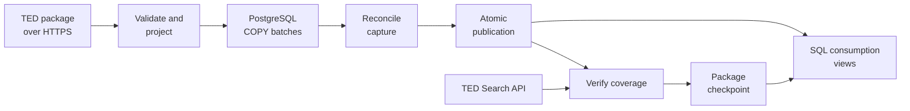

# Tender Ledger

[](https://github.com/alpastorvillar-design/tender-ledger/actions/workflows/ci.yml)

A recoverable pipeline for public procurement notices and PostgreSQL analytics.

**Status:** the archive inspector, a transactional package loader into
PostgreSQL, coverage verification of a loaded capture against the TED Search API,
and a daily ingest command that acquires a package and checkpoints it only when
both hold are implemented. Lint and all 250 tests pass locally against real
PostgreSQL, without skipped tests; the badge above reports the latest CI run on
`main`. The historical run, benchmarks, and orchestration are still pending.

## Problem

Procurement analysts need a queryable record of public notices, changes, and data coverage. Failed downloads and repeated batches must not silently produce missing records or double counting.

The historical target is TED notices across countries for 2020–2025, with Spain as one analytical case. Completion requires at least one million distinct real notices, reconciled coverage, measured SQL performance, and recovery evidence.

## What it delivers

Load a TED archive into a queryable database, repeat the load safely, and recover
from an interruption without rewriting committed batches. Analysts can count
distinct notices by publication month, buyer country, and procurement category
without double counting overlapping source packages.

| Implemented | Evidence |
| --- | --- |
| Legacy XML and eForms inspection and projection | 2,967 real notices from one mixed daily package |
| Durable batch loading and atomic publication | Recovery, reader visibility, concurrency, and corruption tests |
| SQL over published, deduplicated notices | Monthly counts reconcile to all 2,967 loaded notices |
| Coverage verification against the Search API | A live run matched all 2,967 identifiers of that capture across 13 requests |
| Explicit coverage state | Verified, mismatch, unavailable and unconfirmed-empty are four different answers, each with its recorded evidence |
| Bounded, recoverable package download | Truncation, oversized bodies, redirects off-origin, corrupt archives and 404s are all refused; interruptions restart from byte zero |
| A checkpoint that only a complete flow can seal | Validated artifact plus published capture plus a named verified attempt, re-checked in one transaction and read back |

## Architecture



Python implements archive handling, ingestion and verification. PostgreSQL stores
notice data and transactional state; Docker Compose provides the local database.
A restricted reader role sees published notice rows while incomplete replacements
remain internal. The filesystem and the database share no transaction, so the
ingest run records each durable step and recovers from it; Airflow will later
coordinate the verified workflow.

See [source and design decisions](docs/design.md),
[transaction boundaries and recovery](docs/loading.md),
[coverage verification](docs/verification.md),
[download, recovery and checkpoint](docs/ingestion.md), and
[field projection](docs/projection.md).

## Quick start

Requires Python 3.13+ and Docker with Linux containers; the validated Python
version is 3.14.3. From a terminal:

```sh
git clone https://github.com/alpastorvillar-design/tender-ledger.git
cd tender-ledger
python -m venv .venv
```

Activate the environment with `.venv\Scripts\Activate.ps1` in PowerShell or
`source .venv/bin/activate` in Bash, then run:

```sh
python -m pip install -e ".[dev]" -c constraints.txt
python scripts/create_local_env.py
docker compose up -d --wait postgres
python -m tender_ledger db upgrade
python scripts/run_tests.py
```

This runs synthetic correctness fixtures against PostgreSQL; it does not download
the historical dataset. To inspect and load real data, download a package from
[TED](https://ted.europa.eu/packages/daily/202300220) into the ignored `data/`
directory and follow the commands below. That mixed daily package was about
12 MiB compressed when checked. Keep its source package ID with the file.
See [local development](docs/local-development.md) for configuration and persistence.

## Run the inspector

Requires Python 3.13 or newer; tested with Python 3.14.3. The inspector uses only the standard library and needs no installation or network access. The database loader adds one dependency (`psycopg`). The commands below run only the standard-library tests; full-suite setup follows later.

From the repository root in PowerShell:

```powershell
$env:PYTHONPATH = "$PWD/src"
python -m tender_ledger inspect path/to/daily-package.tar.gz
python -m unittest discover -s tests -p test_packages.py -v
python -m unittest discover -s tests -p test_projection.py -v
```

On Linux/macOS:

```sh
PYTHONPATH=src python -m tender_ledger inspect path/to/daily-package.tar.gz
PYTHONPATH=src python -m unittest discover -s tests -p test_packages.py -v
PYTHONPATH=src python -m unittest discover -s tests -p test_projection.py -v
```

The inspector prints a JSON summary with checksums, distinct notice counts, formats, and schema versions. Invalid archives exit with a nonzero status. It checks gzip integrity, duplicate identities, supported roots, required identity fields, and configured resource limits without extracting XML files to disk.

Defaults are 64 MiB compressed, 512 MiB expanded, 8 MiB per member, and 10,000 notices. Limits are explicit CLI options; see `inspect --help`. The identity set uses memory proportional to the notice limit. This bounded inspector is not the historical database loader or a full XML-schema validator.

A successful inspection does not establish source completeness: the output always marks `source_coverage_verified` false. That is what `verify` is for, and an empty archive stays unconfirmed even then.

## Load a package into PostgreSQL

After the quick start, load a local archive using its TED package identity:

```sh
python -m tender_ledger load path/to/daily-package.tar.gz --package-id daily/202300220
python -m tender_ledger status --package-id daily/202300220
```

The loader persists a capture identity before loading, streams and projects
members (see [projection contract](docs/projection.md)), writes deterministic
`COPY` batches whose rows and status commit together, reconciles counts, and
publishes the capture with a single transactional pointer swap. Retries resume,
re-acquisitions are new captures, and readers keep the previous complete capture
until a replacement publishes. Full semantics and guarantees:
[transactional loading](docs/loading.md). Example analytical and diagnostic SQL
is under [`queries/`](queries/).

## Verify what the source says it published

A complete local load is not evidence that the archive held the whole issue:

```sh
python -m tender_ledger verify --capture-id 1
```

The capture's identity produces the query - `daily/202300220` is OJ S issue 220
of 2023, not the 220th day - and the command compares every canonical identifier
the API reports with the ones in that capture. It exits 0 only when a `verified`
row is committed. `mismatch`, `unavailable` and `empty_unconfirmed` are three
different failures, each recorded with its counts, its bounded difference
samples, and a key digest when a complete key set was seen. `coverage_verified`
tracks the latest attempt, so a later failure lowers it and keeps the earlier
evidence in the history.

Ending the walk is the hard part: the source's last page of data was short, and
the page after it was empty while still returning a pagination token, so neither
signal ends it. Records, distinct identifiers and the announced total must agree.
See [coverage verification](docs/verification.md) for the states, budgets, retry
rules and locking, and [`queries/`](queries/README.md) for reporting them.

## Process one package end to end

`load` says the archive loaded; `verify` says the source agrees. Neither makes a
package processed. This does:

```sh
python -m tender_ledger ingest --package-id daily/202300220
```

The URL is derived from the identity and cannot be supplied on the command line.
The archive is streamed to a temporary file under byte and time budgets,
validated as a complete gzip-tar package, fsynced and renamed into `data/`, and
only then referenced in the database. The capture link is written in the same
transaction that creates the capture, so an interruption before the first batch
still knows which capture to resume. Exit code 0 means a checkpoint naming the
artifact checksum, the published capture and the specific verified attempt,
re-checked in one short transaction and read back after it commits.

Whether that checkpoint still describes the package is derived, not stored: a
`load --force-recapture` or a later failed check retires it while keeping the
evidence of what was sealed. Re-running `ingest` with a current checkpoint
re-validates the stored artifact and replays the existing success without a
single request. See [ingestion](docs/ingestion.md) for the recovery table,
budgets and locking.

## Query the result

The consumption grain is one canonical publication per row, even when daily and
monthly packages overlap. Count it directly:

```sql
select count(*) as distinct_notices
from tl_read.distinct_notice;
```

[Monthly counts](queries/monthly_notice_counts.sql) groups those notices by
publication month, buyer country, and primary CPV division. The verified daily
load produced **611 groups whose counts sum to 2,967**. Missing classifications
remain explicit. These counts describe published notices, not awarded contracts
or procurement spending.

[Diagnostics](queries/diagnostics.sql) exposes capture status, missing fields,
schema versions, and source overlap. [Coverage status](queries/coverage_status.sql)
reports every published capture including never-verified ones, and
[verification history](queries/verification_history.sql) lists each capture's
attempts in order. [Ingest status](queries/ingest_status.sql) separates a package
that was never checkpointed from one whose checkpoint a later acquisition or a
later coverage check retired, and [ingest history](queries/ingest_history.sql)
shows how far each run got. [`queries/README.md`](queries/README.md) states each query's
grain and how it treats missing values.

## Verified evidence

- Six annual API counts sum to **4,523,626 reported results** for 2020–2025. These are not loaded database rows.
- HEAD responses for 72 monthly packages total **16,783,140,714 bytes (15.63 GiB)** compressed; the historical packages have not been downloaded.
- A real mixed daily package contained **2,967 distinct notices**: 1,813 legacy and 1,154 eForms. Its complete identifier set matched the API across 12 pages.
- The inspector processed that package successfully; its checks are covered by automated tests.
- That same real package (2,967 notices, 1,813 legacy + 1,154 eForms) was loaded into PostgreSQL as an M1 smoke: members, distinct keys, and loaded rows all reconciled at 2,967, a replay was a no-op, and every view reported `source_coverage_verified = false`.
- The full test suite is **250 tests**, run locally without skips: archive/projection tests, HTTP and pagination tests against local test servers and a scripted transport, and real-database tests for replay, durable batches, caller-transaction rejection, interrupted recapture, cancellation, publish visibility, corruption, A/B/A, retired members, concurrency, recovery equivalence, and coverage-verification outcomes. Regression tests reject late or truncated HTTP responses and unknown counts supporting a verification claim. The ingest tests interrupt the flow at each durable boundary -- including a real termination of a test-only PostgreSQL session during the checkpoint transaction -- resume from another connection, and compare the result with a clean run over the same bytes.
- **Live verification** against the TED Search API on 2026-09-03 matched all 2,967 identifiers in 13 requests, with no duplicates or differences. The check passed on a disposable copy before migration 0003 was applied to development. Verification of the development capture then committed `source_coverage_verified = true`, preserving all notice rows, batches, and the publication pointer. The canonical key digest matched earlier independent comparisons of the same issue.
- An additional local recovery probe terminated its own PostgreSQL writer session after a committed batch. The retry kept the capture identity, skipped the committed batch, and published the remaining rows. This is a controlled failure test, not a production incident.

Inspector checks were performed on 2026-09-02; the loader smoke on 2026-09-03. No cloud deployment or historical performance benchmark has run.

See [design and source contract](docs/design.md), [projection contract](docs/projection.md), [transactional loading](docs/loading.md), and [scale and SQL requirements](docs/scale-and-sql.md).

## Local database setup

[Local development](docs/local-development.md) describes the prepared PostgreSQL
Compose configuration, private password generation, and data persistence. The
PostgreSQL 17.11 container passed connectivity, transaction rollback, and restart
persistence checks on 2026-09-03, and now runs the loader's schema and integration
tests (against a dedicated `tender_ledger_test` database).

## Continuous integration

[CI](.github/workflows/ci.yml) uses Python 3.14.3 and a disposable PostgreSQL
17.11 service, installs the constrained dependencies, runs Ruff, and executes
the full suite. Skipped tests fail the gate, so an unavailable database cannot
produce a successful integration result. No TED download is part of CI.

To run the same lint and test commands locally after the environment setup:

```sh
python -m ruff check src tests scripts --no-cache
python scripts/run_tests.py
```

The test runner creates and replaces its dedicated test databases; use a local
development server or disposable CI service. It does not target the development
database. The most recent
[GitHub-hosted verification run](https://github.com/alpastorvillar-design/tender-ledger/actions/runs/33760400881)
recorded here passed Ruff and 174 tests on Ubuntu 24.04, Python 3.14.3, and
PostgreSQL 17.11; the badge above reports the current state of `main`.

## Roadmap and limits

1. Monthly packages and a bounded backfill over selected periods.
2. A measured rehearsal with at least 100,000 real notices, followed by at least
   one million distinct notices toward the 2020–2025 historical target.
3. Six SQL workloads with correctness checks, query plans, storage measurements,
   and recovery results; then local Airflow orchestration.

The current real-data validation covers one mixed day, loaded and verified. The
ingest command processes one named daily package; there is no calendar, no
backfill and no retention of old artifacts yet.
Historical completeness, large-dataset performance, and cloud execution have not
been demonstrated. Coverage has been verified for that single capture; it says
nothing about any other period.
Source artifacts and database volumes stay outside Git. Synthetic fixtures test
correctness and failures; they do not count toward the real-data scale target.
The implemented projection excludes contact details and monetary amounts.

[Scale and SQL requirements](docs/scale-and-sql.md) defines the remaining gates.
Local execution requires no cloud account or paid API.

## Sources

[TED XML packages](https://docs.ted.europa.eu/ODS/latest/reuse/download-xml.html), [direct download conventions](https://docs.ted.europa.eu/ODS/latest/reuse/download-direct.html), and [Search API](https://docs.ted.europa.eu/api/latest/search.html).
