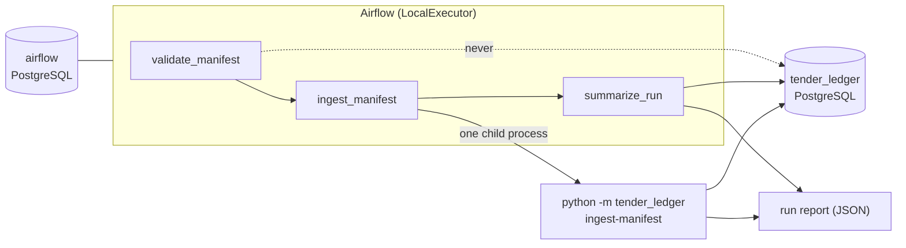

# Local orchestration with Airflow

Status: a local Apache Airflow 3.3.1 stack runs the accepted manifest flow. It
schedules, retries and reports; it owns none of the pipeline's state.

Airflow adds three things this project did not have: a run that survives losing
the process that was executing it, a place where the shape and history of that
work is visible, and a single entry point an operator triggers instead of
remembering a command line. It adds no new guarantee about the data. Every
guarantee about acquisition, loading, coverage and checkpoints is still the one
[`ingest`](ingestion.md) and [`ingest-manifest`](backfill.md) already had.

## What runs where



Two databases, deliberately: Airflow's own metadata lives in a separate
PostgreSQL service with its own volume, so no scheduler table is ever created
next to the notice data, and dropping the orchestration stack cannot touch a
capture, a checkpoint or a published pointer.

| Service | Command | Why it exists |
| --- | --- | --- |
| `airflow-metadata` | PostgreSQL 17.11 | Airflow's own state; no published port |
| `airflow-init` | `version` | Runs Airflow's migrations and creates the local UI account, once per `up` |
| `airflow-apiserver` | `api-server` | The UI and the execution API, bound to `127.0.0.1` |
| `airflow-scheduler` | `scheduler` | Schedules **and**, under LocalExecutor, runs the tasks |
| `airflow-dag-processor` | `dag-processor` | Parses the Dag folder, separately from the scheduler |

There is no Celery, Redis, Kubernetes or triggerer: nothing here is deferrable,
distributed or hosted. The image is the official
`apache/airflow:3.3.1-python3.13`, pinned by manifest digest, with this project
installed into it under a constraint that keeps Airflow at 3.3.1.

## The Dag

`tender_ledger_manifest` has no schedule (`schedule=None`, `catchup=False`) and
allows one run at a time. TED package identities are OJ issue numbers and
archive months, not calendar days a scheduler could derive, so a person
triggers a named manifest instead.

| Task | Does | Retries | Timeout |
| --- | --- | --- | --- |
| `validate_manifest` | Resolves the `manifest` parameter and validates the document | 0 | Dag default |
| `ingest_manifest` | Runs `ingest-manifest` once, as a child process | 1, after 1 minute | 4 hours |
| `summarize_run` | Reads the report and the status view, emits the summary | 1, after 1 minute | Dag default |

Validation is not retried: a manifest that fails the strict schema fails it
again a minute later. The ingest task is, because losing a process or a
transport is exactly the failure a retry fixes. Two different Airflow
mechanisms notice that loss, and both are tuned here for a single local host:
a task whose process dies while the scheduler survives is failed after
`[scheduler] task_instance_heartbeat_timeout` (60 s instead of 300 s), while a
task lost together with the scheduler is recovered by the orphaned-task reset,
which only runs every `[scheduler] orphaned_tasks_check_interval` (30 s instead
of 300 s) and only once the dead scheduler's own heartbeat has aged past
`scheduler_health_check_threshold`. Neither setting changes what recovery
does; they change how long it takes to start. Four hours covers the measured
cold run of the 26-package manifest (8,106.8 s) with room to spare, and still
ends a task that is stuck rather than letting it hold the only run slot; the
child process is killed five minutes before that, so no ingest outlives the
task that started it.

The manifest parameter is a repository-relative path that has to stay under
`manifests/`, exist, and pass the same strict schema the command applies. An
absolute path, a traversal, a path outside that directory, an unparseable
document and an unknown key are all refused before any connection is opened.
The validated digest is passed to `ingest-manifest`, which checks it again before
opening PostgreSQL or making a request; a file changed between Airflow tasks is
therefore refused before it can process a different package list.
The default is
[`manifests/m3-scale-verified.json`](../manifests/m3-scale-verified.json), the
26 packages whose coverage the source confirmed exactly.
[`manifests/m3-scale.json`](../manifests/m3-scale.json) remains runnable and
still stops at `monthly/2021-05`: the command exits non-zero and the task
fails, which is the point of keeping it.

### Why one task, not one task per package

A manifest is sequential and stops at the first package it cannot process.
Expanding it into one mapped task per package would need Airflow to guarantee
the order of expanded tasks, which it does not, and would copy the pipeline's
own progress into XCom and Airflow's database — a second, weaker record of
what `tl_work.ingest_run` and `tl_work.package_checkpoint` already hold. So the
manifest runs as one unit, and XCom carries only small values: a relative path,
a digest, counts and durations. No archive, notice list, credential, URL or
absolute host path passes through it.

## Airflow state is not pipeline state

| Airflow says | Tender Ledger says |
| --- | --- |
| Task `success` | Nothing by itself; the summary task is what checks the database |
| Task `up_for_retry` after a lost process | Whatever the package durably reached: a sealed checkpoint, or a phase to resume from |
| Task `failed` | The command exited non-zero; the report names the package it stopped at |
| A second Dag run | A second `ingest-manifest`: current checkpoints replay, an interrupted package resumes |

The summary task deliberately re-reads `tl_read.package_ingest_status` after
the command has finished. The report describes what the command saw while it
ran; the view says what is true now. A checkpoint retired in between — by a
re-acquisition, or by a coverage check that stopped agreeing — fails the run
even though the command exited 0.

## Running it

From the repository root, after the [local database setup](local-development.md):

```sh
python scripts/create_local_env.py
mkdir -p logs/airflow artifacts/orchestration
docker compose -f compose.yaml -f compose.airflow.yaml build
docker compose -f compose.yaml -f compose.airflow.yaml up -d --wait
```

On PowerShell, create the two directories with
`New-Item -ItemType Directory -Force logs/airflow, artifacts/orchestration`.

`create_local_env.py` adds only the settings `.env` does not have yet, so an
existing PostgreSQL password is never rewritten — which matters, because
changing it would not change the password of an initialized volume. Set
`TL_ORCHESTRATION_DB` in `.env` to the database that holds the packages your
manifest names; it defaults to `tender_ledger`.

Then check that the Dag folder is clean, and trigger a run:

```sh
docker compose -f compose.yaml -f compose.airflow.yaml exec airflow-scheduler \
    airflow dags list-import-errors
docker compose -f compose.yaml -f compose.airflow.yaml exec airflow-scheduler \
    airflow dags trigger tender_ledger_manifest --run-id my-run
docker compose -f compose.yaml -f compose.airflow.yaml exec airflow-scheduler \
    airflow tasks states-for-dag-run tender_ledger_manifest my-run
```

Pass a different manifest with
`--conf '{"manifest": "manifests/m4-retry-drill.json"}'`. The UI is at
`http://127.0.0.1:8080` as `admin`, with the password `.env` holds. Task logs
are under `logs/airflow/`, and each run writes one JSON report named after its
run id under `artifacts/orchestration/`. Both directories are ignored by Git.

Stop the stack with
`docker compose -f compose.yaml -f compose.airflow.yaml down`. That removes the
containers and keeps every volume; `--volumes` would delete the databases and
is not part of routine use. `docker compose up -d --wait postgres` on its own
still starts only the pipeline database, exactly as before.

## The Dag's own tests

The Dag's contract is asserted inside the same image the stack runs:

```sh
docker compose -f compose.yaml -f compose.airflow.yaml run --rm --no-deps \
    airflow-scheduler python -m unittest discover -s /opt/tender-ledger/tests_airflow
```

Those tests need an Airflow runtime, so they are not part of
`scripts/run_tests.py`; an Airflow that cannot be imported makes them error
rather than skip. Everything that does not need Airflow — manifest resolution,
the argument vector, the child process and its timeout, the report checks and
the status-view check — is in the ordinary suite as
`tests/test_orchestration.py`.

## What the rehearsal measured

Run on 2026-09-06 against `tender_ledger_m3_scale`, the database the
[million-notice run](million-notice-run.md) produced, on Docker Engine 29.7.2
and Docker Desktop 4.89.0 with the WSL 2 backend. Airflow reported
`metadatabase`, `scheduler` and `dag_processor` healthy, and `triggerer` as
absent, which it is.

| Task | Result | Seconds |
| --- | --- | ---: |
| `validate_manifest` | success | 2.6 |
| `ingest_manifest` | success | 640.0 |
| `summarize_run` | success | 0.2 |

The command replayed the whole verified manifest: **26 packages, all
`replayed`, 0 HTTP attempts and 0 bytes downloaded**, every checkpoint still
current, and 1,396,555 notices accounted for by those checkpoints -- summed per
package, so the 2,967 notices the daily package shares with `monthly/2023-11`
are counted twice. The report's manifest digest matched the one the first task
had validated.

Nothing durable changed in either pipeline database. Captures, published
pointers, notice rows, distinct notices, batches, runs, checkpoints,
verification attempts, change references and database size were identical
before and after, in the scale database and in the development one the run
never touches. The server's WAL position moved, but that is a cluster-wide
counter shared with everything else on the instance, so the per-database counts
are the evidence, not the LSN.

### A refused manifest is a failed run, not a quiet one

Triggering the Dag with `manifests/../data/nope.json` ended with
`validate_manifest` failed on its only attempt -- it is not retried -- both
later tasks `upstream_failed`, and the Dag run `failed`. The task log carries
the reason, `must stay under manifests/`, and nothing downstream ran: no
connection was opened and no byte was fetched on behalf of that request.

### Losing the process that was running the task

The drill uses [`manifests/m4-retry-drill.json`](../manifests/m4-retry-drill.json),
one already-verified package large enough to interrupt while it is being
replayed. Once `ingest_manifest` was running, its processes were identified by
the task instance's own id -- the executor slot, the task supervisor, and the
`python -m tender_ledger ingest-manifest` child whose command line names this
run's report -- and the container that executes tasks was killed with SIGKILL
(exit 137, not an out-of-memory kill) and started again.

All times UTC.

| Attempt | State | Started | Ended | Seconds |
| --- | --- | --- | --- | ---: |
| `validate_manifest` try 1 | success | 18:27:44 | 18:27:47 | 2.8 |
| `ingest_manifest` try 1 | failed | 18:27:47 | 18:28:46 | 58.4 |
| `ingest_manifest` try 2 | success | 18:28:47 | 18:29:33 | 46.2 |
| `summarize_run` try 1 | success | 18:29:33 | 18:29:34 | 1.2 |

The container was killed at 18:27:57 and try 2 began at 18:28:47: **50 seconds**
from losing the process to running again, and the Dag run finished
successfully.
The abandoned attempt is kept as its own row, so the history shows a failed try
and a successful one rather than a single tidy success. The same drill with
Airflow's default 300-second orphaned-task interval took 5 minutes 20 seconds to
reach try 2 — the same recovery, waiting on a timer.

What the retry did **not** do is as important. It replayed the package: outcome
`replayed`, 0 HTTP attempts, 0 bytes, and the same run, capture and verification
attempt ids as before the kill, with the checkpoint still current. No new
capture, run, checkpoint or verification attempt was created by the interruption
or by the retry, and both pipeline databases held identical counts before and
after. Airflow re-ran a command; the pipeline recognised its own finished work.

## Retention

Nothing here deletes anything, and no cleanup runs on a schedule. What the
stack accumulates, and what may be removed by hand:

| What | Where | Keep |
| --- | --- | --- |
| Source archives | `data/` (ignored) | Every archive a current checkpoint names, and `monthly/2021-05`, whose evidence documents a gap in the source |
| Run reports | `artifacts/orchestration/` (ignored) | Any report a published claim cites; the rest are re-creatable by re-running the manifest |
| Airflow task logs | `logs/airflow/` (ignored) | As long as they explain a run someone may ask about |
| Airflow metadata | `airflow_metadata_data` volume | Run and task history; safe to drop and recreate, at the cost of that history |
| Pipeline data | `postgres_data` volume | Never removed as cleanup: it holds the captures, checkpoints and notices |

Three rules make that safe to act on. An archive named by a current checkpoint
is never deleted: replay re-validates the bytes, so removing the file retires
the evidence and forces a fresh download. A report or log cited by a published
result is never deleted. And nothing is deleted automatically: a future cleanup
command should list its candidates as a dry run and require an explicit
confirmation, which is why this milestone ships the policy and not the command.

Two footnotes worth knowing before "freeing space" locally. Removing files
inside WSL 2 does not shrink Docker's virtual disk, so the host footprint stays
where its high-water mark left it. And Airflow's metadata database grows with
run history, not with the size of the data: `airflow db clean` exists for that
and is not wired into anything here.

## Troubleshooting

| Symptom | Cause |
| --- | --- |
| `up` fails naming a variable | `.env` is missing a setting; run `python scripts/create_local_env.py` |
| A task fails with `TL_ORCHESTRATION_HOME is not set` or a directory not mounted | The container is missing a bind mount; the three directories under that root must all exist on the host |
| `No manifest file at ...` | The path is not relative to the repository root, or not under `manifests/` |
| The run stops at `monthly/2021-05` | Expected for the 27-entry audit manifest: TED's API and its monthly archive disagree, and nothing here hides that |
| A task fails to connect to PostgreSQL | The pipeline database is reached as `postgres:5432` over the Compose network; both files must be passed to `docker compose` |
| The UI shows nothing under the Dag | `airflow dags list-import-errors` reports parse failures |

Non-destructive cleanup: `docker compose ... down` (containers only), deleting
report files, and deleting task logs. Destructive, and never part of routine
use: `down --volumes`, removing `data/`, and dropping the pipeline database.

## What this does not demonstrate

Local orchestration is not a deployment. There is one host and no scheduler
redundancy; a Dag that is not running is simply not running. There is no TLS,
no external identity, no secret manager, and no network policy: the UI is on
the loopback interface and the credentials are in a developer's `.env`.
Resource limits are development settings, not a capacity study.

Nothing here has run in a cloud, on a managed Airflow, or against a shared
database. There is no schedule, no calendar of TED publications, no alerting,
and no parallelism across packages. The retry evidence below is one controlled
failure — a killed container — not a survey of failure modes.
